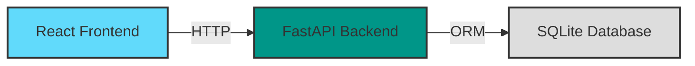

# 🚰 WaterLog - Sistema de Gestión de Rutas

Sistema de control de inventario y trazabilidad para empresas purificadoras de agua.

[](LICENSE)
[](https://www.python.org/downloads/)
[](https://reactjs.org/)
[](https://www.docker.com/)

## 🎯 Problema que Resuelve

Elimina la fuga de activos (garrafones) y dinero mediante un sistema de trazabilidad estricto que:
- ✅ Registra digitalmente cada salida (Check-out) y entrada (Check-in) de inventario
- ✅ Calcula automáticamente discrepancias y deudas monetarias
- ✅ Gestiona evidencia de mermas y roturas
- ✅ Genera auditoría inmutable de todas las operaciones
- ✅ Elimina el "costo cero" del robo mediante *accountability*

## 🏗️ Arquitectura


**Stack Tecnológico:**
- **Frontend**: React 18 + Vite + TailwindCSS + React Query
- **Backend**: Python 3.11 + FastAPI + SQLAlchemy + Pydantic
- **Database**: SQLite (Persistencia en volumen Docker)
- **Infrastructure**: Docker + Docker Compose

## 🚀 Quick Start

### Prerrequisitos
- Docker Desktop & Docker Compose
- Git

### Instalación Rápida
```bash
# 1. Clonar el repositorio
git clone https://github.com/DHZ1LL1O/waterlog.git
cd waterlog

# 2. Copiar archivos de configuración (Crear .env si no existen)
# El proyecto ya incluye configuraciones por defecto para desarrollo

# 3. Levantar los contenedores
docker compose up -d --build

# 4. Acceder a la aplicación
# Frontend: http://localhost:3001
# Backend API: http://localhost:8000
# Documentación API: http://localhost:8000/docs
```

**Usuario Administrador por defecto:**
```
Usuario: admin
Password: admin123
```

⚠️ **Nota**: El sistema cuenta con scripts de seeding para inicializar datos de prueba.

## 📋 Uso Básico

### Flujo de Trabajo Diario

1. **Check-out (Salida)**:
   - El supervisor selecciona chofer y camioneta
   - Se ingresa la carga inicial (Garrafones llenos)
   - Se registra la Hora de Salida automáticamente

2. **Operación en Campo**:
   - El chofer realiza su ruta de venta

3. **Check-in (Regreso)**:
   - El supervisor registra el inventario retornado (Llenos, Vacíos y Dañados)
   - El sistema calcula: `Ventas = Carga Inicial - (Llenos Retornados)`
   - Se compara contra el efectivo o tickets entregados (Fase de conciliación)
   - El sistema muestra un resumen de tiempos y deuda

## 🔧 Desarrollo Local

Si deseas ejecutarlo sin Docker:

**Backend:**
```bash
cd backend
python -m venv venv
source venv/bin/activate  # Windows: venv\Scripts\activate
pip install -r requirements.txt
uvicorn app.main:app --reload
```

**Frontend:**
```bash
cd frontend
npm install
npm run dev
```

## 📊 Estado del Proyecto (v0.2.0)

### Fase 1 - MVP (Completado) ✅
- [x] Dockerización completa del entorno
- [x] Autenticación JWT (Login/Logout)
- [x] Gestión de Recursos (Choferes y Camionetas)
- [x] Check-out: Asignación de ruta y validación de inventario
- [x] Check-in: Cálculo de retorno, tiempos y detección de deuda
- [x] Manejo de errores robusto (Frontend/Backend)

### Fase 2 - Próximos Pasos (Roadmap) 🚧
- [ ] Dashboard con gráficas de rendimiento (KPIs)
- [ ] Lógica de precios mixtos (Residencial vs Comercial)
- [ ] Reportes exportables a PDF/Excel
- [ ] Subida de evidencia fotográfica para mermas

## 📖 Documentación
- [Arquitectura del Sistema](docs/architecture.md)
- [API Reference](http://localhost:8000/docs)

## 🤝 Contribuir

1. Fork el proyecto
2. Crear feature branch (`git checkout -b feature/AmazingFeature`)
3. Commit cambios (`git commit -m 'feat: add amazing feature'`)
4. Push al branch (`git push origin feature/AmazingFeature`)
5. Abrir Pull Request

## 👥 Autores

**Diego Herrera Zilli** - Arquitectura y Desarrollo Fullstack - [GitHub](https://github.com/DHZ1LL1O)


